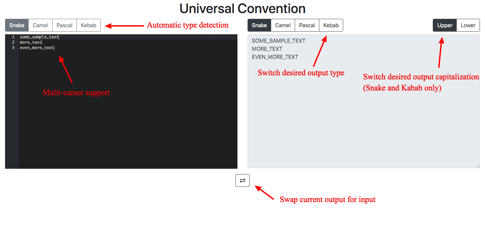

# universal_convention

[Demo](https://tylergauntlett.com/uc/index.html)

Quickly switch from one naming convention to another. Automatically detects the input type and outputs in desired format.

### Supported Types:
- camelCase
- PascalCase
- snake_case
- kebab-case

